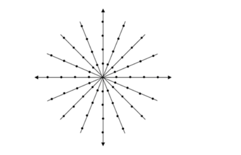

# Ejercicios de Nivel Físico
## Redes de Comunicaciones (TB067)
1. Debido a la expresión de ruido térmico, la potencia de ruido aumenta con el ancho de
banda utilizado. Si usted necesita incrementar la capacidad de un canal al doble, ¿duplicaría el
ancho de banda solamente?

    La potencia del ruido se define como:

    $N_{Ruido} = K*T*B$

    Siendo K la constante de Boltzmann, T la temperatura en Kelvin y B el Ancho de Banda.

    La Capacidad se define como:

    $C = B*log_{2}(1+S/N)$

    Entonces si aumenta el ancho de banda, tambien aumenta la potencia del ruido.
    Si se mejora la relacion señal/rudio entonces funcionaria. Otra podria ser aumentar la cantidad de simbolos para agrandar la capacidad del canal.
        

1. El teorema de Shannon, ¿para qué tipo de ruido está definido?

    Para el Ruido Blanco. Este es un ruido que se puede añadir linealmente a una señal, tiene componentes de todas las frecuencias y tiene un valor medio de 0.

2. Los canales de televisión tienen 6 MHz de ancho de banda. ¿Cuántos bps se podrán
enviar a través de ellos si se utilizan señales digitales codificadas de modo que por cada
símbolo se codifican 6 bits?

    $2^6 = combinaciones = 64 = M$ 

    $C = 2B*log_2(M) = 2*6MHz*log_2(64) = 72 Mbps$

1. Sea un módem que utiliza el diagrama de constelación de la figura, a qué velocidad en
baudios debe operar para poder transmitir a una velocidad de 1 Mbps? ¿Cuál será el ancho de
banda del canal?

    

    16 fases con 4 amplitudes cada una -> 64 QAM

    Cada simbolo equivale a 6 bits

    $C = 2B*log_2(M)$

    $B = C/2*log_2(M) = 1 Mbps/12 = 83,33 KHz$

5. En un extremo transmisor se inyecta una señal de 5 watts, atraviesa un medio de 2 dB
de atenuación, ¿con qué potencia se recibirá en el extremo receptor?

    
    $10log(5000mW/1mW) = 36,9 dBm$

    Psalida = 36,9 - 2 = 34,9 dBm

    PsalidaW = 1mW * 10^3,49 = 3,09 W

    En resumen...
    
    $P(dBm) = 10*log(P(mW)/1mW)$

    $P(mW) = 1mW*10^{P(dB)/10}$

6. Se dispone de un transmisor que tiene un láser que transmite a 0 dBm y un receptor
que es capaz de detectar señales de hasta -25 dBm. Con estos elementos se desea habilitar un
enlace de 100 km a través de un par de fibras ópticas dedicadas con una atenuación de 0,2
dB/km. Para ello se necesitan cinco conexiones con 0,5 dB de pérdidas cada una. Suponga que
los conectores no ocasionan pérdidas.
a. ¿Será posible realizar la conexión?
b. Idem anterior si la potencia disponible se reduce a la mitad.

    $P_{recibida} = P_{transmitida} - Atenuaciones$

    Precibida = 0dBm - (100km * 0.2 dB/km + 5*0.5 dB) = -22.5dB

    Es posible realizar la conexión

    b) Si la potencia se reduce a la mitad, bajan -3dB

    -22,5 dbm partiendo desde -3dB 

    --> -25,5 dBm ---> no es posible la conexión

7. Proponga un diagrama de constelación si se quieren transmitir datos a 120 Mbps por
un canal de 20 MHz de ancho de banda.

    Quiero transmitir a C = 120 Mbps y B = 20 MHz

    120Mbps/2*20MHz = 3

    C = 2B*log_2(M)

    $2^{C/2B} = M = 2^{3}$

    Va a tener 3 bits, por lo que va a tener 8 simbolos

    Puede ser 3 bits en un eje o en una circunferencia equiespaciados (8-QAM O 8-PSK)

8. ¿Con cuántos símbolos diferentes deberá codificarse una señal para transmitir a 256
kbps en un canal de 64 kHz?

    C = 256 kbps, B = 64 kHz
    C/2B = 2

    va a tener 2 bits, por lo que va a tener 4 simbolos

    Puede ser un bit en el eje

9. En un canal de 5 MHz, ¿qué velocidad máxima se podrá detectar si la relación
Señal/Ruido es de 30 dB?

    30 db -> 10*(30/10) = 1000

    C = Blog_2(1+S/N) = 5Mhz * log2(1+1000) = 49,84 Mbps

10.  ¿Cuál será la temperatura de ruido equivalente de un canal con un ancho de banda de
20 kHz, habiéndose medido un nivel de ruido de −130 dBm?

$-130 dBm \rightarrow 1mW * 10^{-130/10} = 10^{-16} W$ 

$N = K*T*B = 1,38*10^{-23} * T * 10MHz = 10^{-16} W$

$\rightarrow T = 362K$

11.  Sabiendo que el Eb/No de una señal es de 25 dB sobre un canal de 128 kbps a 20 °C,
determine la potencia de la señal en dB.

$Eb/No = Es / (\sigma)^2$ = 316,23 veces

Es -> la energia del simbolo -> P*Ts (duracion del simbolo)

128kbit -------- 1s
1 bit ----------- 1bit*s/128kbit = 7,81 microsegundos

-----> P = Es/Ts

Es = 316.23 * sigma^2 /Ts 

varianza = sigma^2 = N = K*T*B = 1,38*10^-23*293*128k = 5.17 *10^-16

---> P = 316,23 . 5,17*10^-16 / 7,81 . 10^-6 = 20,9 nW

10log10(20,9 nW * 10 ^-6 / 1mW) = -46,78 dBm 

12.  Usted debe conectar dos puntos distantes 100 km que transfieren información a razón
de 1 kbit por mensaje. Se dispone de un enlace satelital geoestacionario de 128 kbps y de uno
terrestre de 9600 bps en el que el retardo es de 3 μseg/km. Elija una de las dos opciones
justificando su elección.
13.  Usted necesita transmitir 128 kbps por un canal de 32 kHz de ancho de banda y en
cuyo extremo receptor la temperatura de ruido equivalente es de 1000 °K. La potencia
disponible de la señal es de 4 watts y el medio atenúa 2 dB. ¿Es factible?
14.  En un canal de 8 KHz, ¿qué velocidad máxima se podrá detectar si la relación
Señal/Ruido es de 30 dB?
15.  ¿Por qué los códigos diferenciales pueden ser más inmunes al ruido?
16.  Dibuje los diagramas de estado de las modulaciones 16-PSK y 16-QAM. Suponiendo
que el ruido modifica la amplitud de lo que se transmite, ¿cuál de los dos sistemas es más
inmune al ruido?
17.  Determine un stream de bits codificados en NRZI para el cual resulte equivalente la
codificación de Manchester. ¿Resultaría equivalente también a la de Manchester diferencial?
18.  ¿Cuál es el ancho de banda a utilizar si se quiere transmitir la información a 32 kbps
por un canal codificándola en Manchester? ¿y en Manchester Diferencial?
19.  Si usted tuviera que elegir una codificación para transmitir datos en donde el ancho de
banda está comprometido, ¿cuál de todas elegiría?
20.  Para el stream de bits 011100000010000111 determine la codificación
correspondiente para NRZ, NRZI, Manchester, Manchester diferencial, AMI bipolar y HDB3.
21.  Explique por qué en el código B8ZS se reemplazan los 8 ceros por la secuencia
establecida. Hágalo también con HDB3.