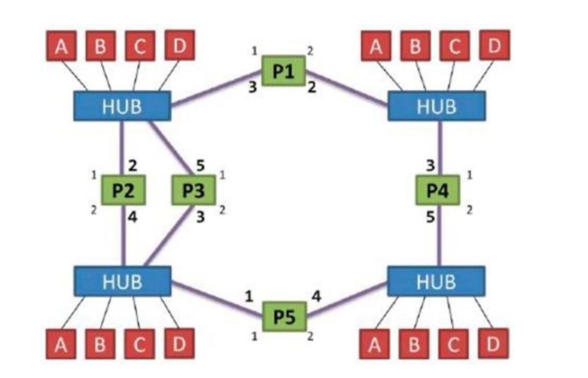
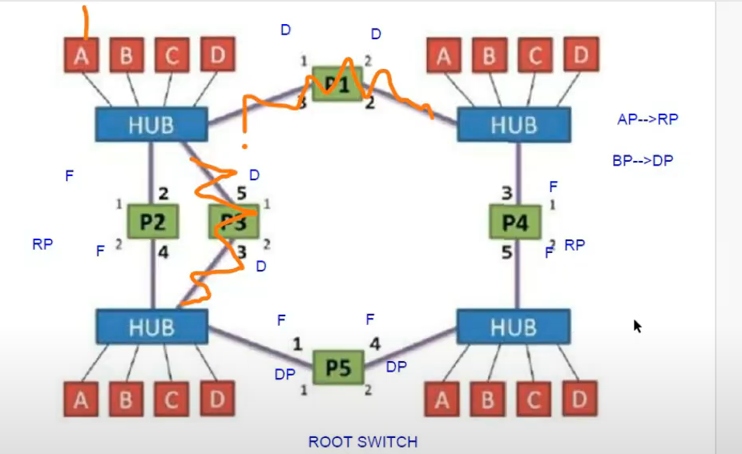
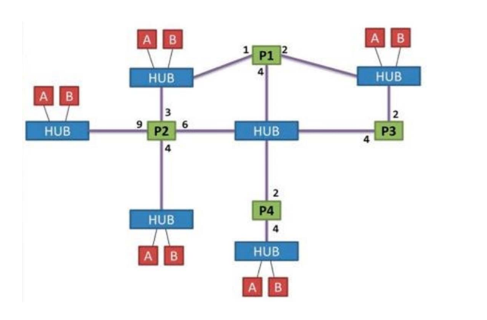
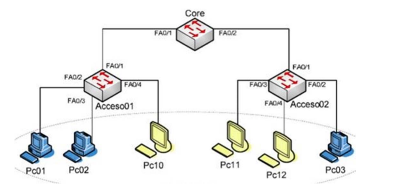
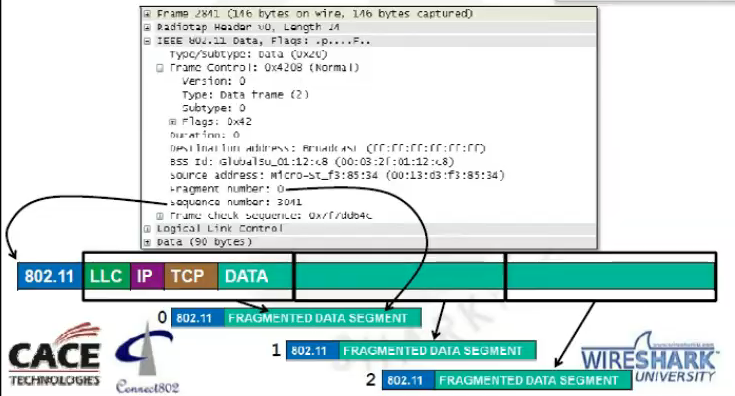
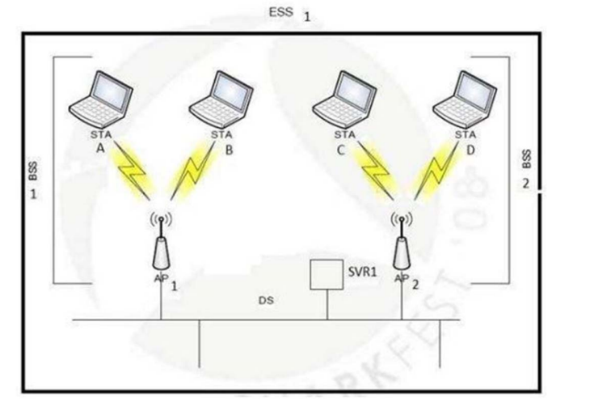
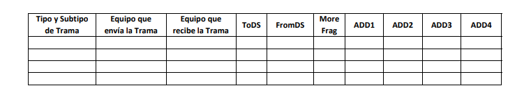
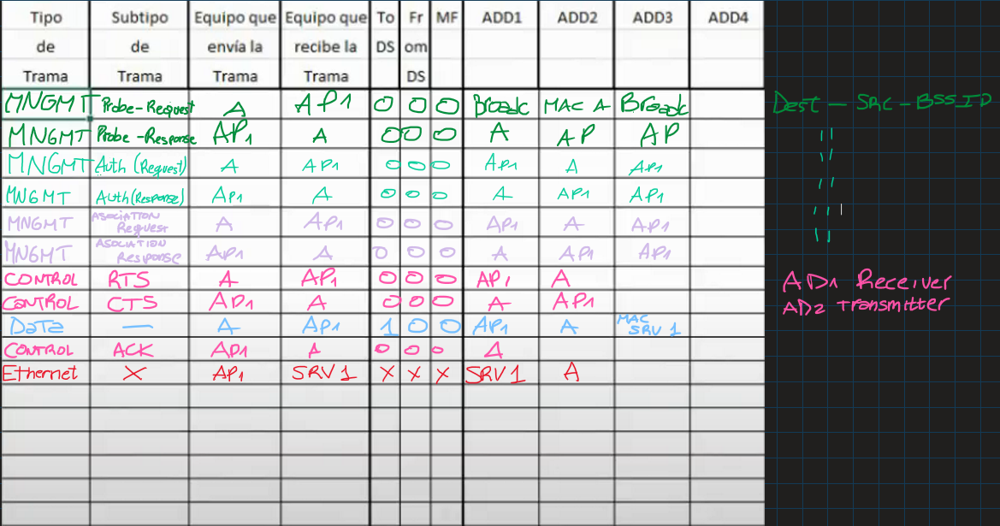

# Guía de Redes LAN - Redes de Comunicaciones

### A) Redes cableadas 
1. Explique los motivos por los cuales se fijaron longitud máxima y mínima en 802.3.

    Se refiere a la longitud minima y máxima de una trama. 802.3 se refiere a la norma del protocolo Ethernet, que es en principio, un bus. Estan todas las maquinas conectadas con todas las maquinas, en la cual dos maquinas se comunican y el resto "hace silencio". La longitud minima de una trama es de 64 bytes, que si fuesen menos no habria tiempo para detectar colisiones. Si la longitud no fuese del tamaño maximo, el dispositivo que esta transmitiendo podria estar monopolizando el ancho de banda.

2. ¿La trama mínima tiene el mismo valor en Fast‐Ethernet? Justifique. 
   
    Ambas tienen el mismo tamaño de trama mínima por el mismo motivo del protocolo Ethernet.

3. ¿Qué ocurre en Gigabit‐Ethernet? 

    La trama mínima en Gigabit-Ethernet es de 512 bytes, porque de lo contrario se transmitiría tan rápido que no se detectaría.

4. ¿Cómo calcularía Ud. la máxima distancia de un medio de comunicación, si se conoce la 
velocidad de propagación de dicho medio? 

    $v_{prop} = 3*10^8 m/s$ 

    o también

    $v_{prop} = 300.000  km/s$

    Si la distancia L se tarda en recorrer un cierto tiempo T, la velocidad es L/T, entonces:

    $L = v_{prop}*T$

5. ¿Por qué pueden subsistir en un mismo segmento Ethernet II y 802.3? 

    Ethernet II tiene un campo en el header que especifica el tipo de protocolo, mientras que 802.3 está la longitud de la trama. Pueden subsistir ya que los equipos modernos negocian que tipo de trama usar y se adaptan.

6. Indique si lo siguiente es verdadero o falso, justifique. El número de colisiones en Ethernet: 

    a) Depende de la cantidad de estaciones.

    V: Habrían más colisiones por la cantidad de equipos

    b) Es menor si se utiliza un Hub con 10BT 
    
    F: Van a haber más colisiones ya que desde el punto de vista de los tiempos de transmision si hay 5 equipos conectados al hub, entonces hay 5 equipos transmitiendo. Cuantas mas estaciones hayan en el hub, mas probabilidad hay de colisiones.

7. ¿Qué se entiende por dominio de colisión? ¿Y por dominio de broadcast? Dar ejemplos. 
   
    Un dominio de colisión es un segmento de red donde los paquetes de datos pueden colisionar si se transmiten al mismo tiempo. Ejemplo: 4 computadoras en una casa conectadas a un mismo HUB.

    Un dominio de broadcast es cuando los equipos conectados a un segmento de red, todos los equipos procesan una trama enviada.

8. Considere un nivel de acceso CSMA/CD para una velocidad de 1 Gbps con una longitud de 1 km 
de cable sin repetidores. La velocidad en el cable es de 200.000 km/seg. Determine la longitud 
mínima de la trama. 

    CARRIER SENSE MULTIPLE ACCESS / COLITION DETECTION

    $v_{transmision} / v_{cable} = long_{min}$

    $\frac{1*10^9 b/s}{ 2*10^5 km/s} = long_{min} = 5000 bits/km$

    Para $1 km \rightarrow long_{min} = 5000 bits= 625 bytes$
    
    En realidad la longitud es el doble ya que hay que tener en cuenta la ida y la vuelta en la transmision

9. Si en una topología 802.3 se produjese una colisión entre frames enviados por dos DTEs 
entonces los DTEs intervinientes pudieron transmitir: (DTE = Data Terminal Equipment) 
a) Más de 64 bytes de datos hasta 1518 bytes  
b) Menos de 64 bytes de datos 
c) Exactamente 64 bytes de datos 

     La respuesta es la A. En el momento que se detecta la colision, seguro el tamaño está entre el minimo y el maximo

10.  ¿Qué es el mecanismo de Back‐off como parte del control de acceso al medio? Explique lo que 
sucede cuando dos estaciones intentan transmitir al mismo tiempo, y luego una tercera estación 
se suma a la contienda. 

    Cuando a un Host le llega que no hubo una colision al enviar la trama, se calla y entra el mecanismo Back-off

11.  Se disponen de 500 estaciones en una red LAN que pueden intercambiar mensajes entre ellas de 
1024 bytes. Cada estación envía un mensaje por segundo. ¿Qué tipo de tecnología eligiría: 
Ethernet, Fast‐Ehternet o Gigabit‐Ethernet? 

    Supongamos una velocidad de 10 Mbps en Ethernet. En Fast Ethernet seria de 100 Mbps y en Gigabit Ethernet, 1000 Mbps.

    Por ej. para G-E : 1000Mbps / 500 maquinas = 2Mbps 

12.  ¿Qué son las normas ANSI/EIA/TIA‐568A y ANSI/EIA/TIA‐568B? ¿Para qué se usan? 
   
    Son normas para los cables de Ethernet

13. Una red Ethernet tiene la estructura representada en la imagen:
Los números 1 y 2 indican la identificación de la interfaz de cada switch (P1 a P5). Los números 
en negrita indican el costo del enlace. Se supone que el switch P5 es el elegido como raíz. Los 
demás switches tienen la misma prioridad. Indicar el estado de los ports al completarse la 
ejecución de RSTP. 

    Los switches se envian mensajes BPDU (Bridge Protocol Data Unit) y que por lo general llevan informacion de un switch a otro. El BID (Bridge Identifier) es un numerito. Cada Switch tiene un BID único. Los 2 bytes de mas peso son la prioridad, y el resto la direccion MAC. El BID de un switch de una jerarquía mas alta es mas chico que el de una más baja.

    El Route Raíz es el que tiene menor BID. 
    Los puertos tienen 3 estados posibles:
    Discard, Learning y Forwarding

    Lo que es distinto en cada modo es si recibe una trama, si aprende la direccion mac de la trama recibida y si reenvia trafico. 

    Modo discard no estan en la topologia activa (no hacen nada). Learning recibe tramas y aprende macs pero no forwardean. Forwarding memoriza, recibe, aprende y forwardea trafico.

    Por qué no pasa directo de Discard a Forwarding? Primero pasa por Learning porque no tiene armada su tabla de direcciones MAC, y este aprendizaje dura 15 segundos. Si no fuera asi habria una tremenda avalancha de broadcast buscando cual seria el route bridge.

    Los roles de los puertos pueden ser Route Port, que es el puerto por el que se envian las tramas a Route Bridge. Es decir, es un puerto de salida de un Switch por el que esta conectado un enlace que se dirije directamente, o a través de otro switch, al switch route. Otro modo es el Designated Port que es el puerto con mejor BPDU, es el puerto de entrada a un Switch. En el Route Bridge, todos los puertos son DP. Los otros dos Roles son Alternated y Back-Up Port (Reemplazan al RP y al DP respectivamente).

    Volviendo al ejercicio, hay un lazo entre P5, P3, P1, P4. 

    P5 es la raíz, asi que en la topologia activa p1 no va a estar.

    Entre P2 Y P3 va a quedar el que tenga menor costo, que es el P2.

    Queda entonces de la siguiente forma:

1.  Una red Ethernet tiene la estructura representada en la imagen:

Se supone que el switch P1 es el elegido como raíz. Los costos de los puertos de los switches se 
indican en la imagen. 
a) Indicar el estado de los ports y el árbol resultante después de completarse la ejecución de 
RSTP. 
b) Si a este ejercicio le añadimos una conexión entre P4 y el hub que se encuentra a su 
izquierda, ¿cómo quedaría el árbol? Se considera que el costo de salida del nuevo puerto de P4 
es de 1. 

## VLAN - Redes Virtuales

15.  La empresa Loquevenga S.A. ha decidido implementar una red de comunicación de datos, para 
facilitar el trabajo de su personal, pero, preocupada por los riesgos de que los trabajadores del 
área de personal pueda ver información sensible del área de contabilidad, diseña una red con la 
topología que se muestra en el siguiente gráfico, en la que se definen 2 VLANs, cada una de las 
cuales se organiza de la siguiente manera: VLAN contabilidad: Pc01 Pc02 Pc03; y VLAN personal: 
Pc10 Pc11 Pc12. La conexión de los equipos a los switches se muestra en el diagrama. Indique la 
configuración necesaria en los switches de manera que los equipos funcionen de acuerdo a los 
requerimientos establecidos. 

    Los puertos pueden ser de acceso o de Trunking. En el switch 1 la fase FA0/1 es de trunking y el resto son de acceso. A la trama que salga del Pc01 el Switch de acceso1 le pone una etiqueta y se la va a sacar el Switch de acceso 2 para mandarsela a la Pc03

    Red         Numero          Host
    Vlan 1        1         Pc01, Pc02, Pc03
    Vlan 2        2         Pc10, Pc11, Pc12

    Puertos SWITCH1
    FA01: TRUNKING - VLAN1, VLAN2
    FA02: ACCESO - VLAN1
    FA03: ACCESO - VLAN1 
    FA04: ACCESO - VLAN2

    Puertos SWITCH2
    FA01: TRUNKING - VLAN1, VLAN2
    FA02: ACCESO - VLAN1
    FA03: ACCESO - VLAN2
    FAO4: ACCESO - VLAN2

    Puertos SWITCH CORE
    FA01: TRUNKING - VLAN1, VLAN2
    FA02: TRUNKING - VLAN1, VLAN2

## B) Redes Wireless 
1. Indique las diferencias principales entre las distintas especificaciones de la familia 802.11 
(802.11a, 802.11b, 802.11g, etc...). 

    802.11 se lanzo en 1997 y tiene una velocidad de 1-2 Mbps 

2. Indique qué mecanismos utiliza el estándar 802.11 para poder transmitir y recibir información 
sin interferencia en la banda no licenciada de 2,4 GHz (ISM Band). 

    Las siglas ISM significan banda asignada para la industria, ciencia y medicina. Una forma para evitar interferencias es usar distintos canales. Otra forma es modulando.

    Los modos son BSS en el que el Access Point (AP) le consulta a cada equipo si tiene informacion para enviar, y FHS, en el cual hay una competencia por el canal.

    Esos modos son descentralizados que intervienen 2 estaciones y nada mas, y otro que es centralizado a traves de un access point y una bss.

3. Explique qué es WiFi y qué relación tiene con el estándar 802.11.

    Wifi es un conjunto de protocolos, y el 802.11 es uno de esos protocolos. Se conecta con el medio por radiofrecuencia, y se conecta a una red LAN
    

4. Explique las diferencias entre el protocolo MAC para 802.3 y 802.11. 

    MAC significa Media Access Control.

    La forma de competir por el canal es CSMA/CD en 802.3 y CSMA/CA en 802.11. En ethernet podes detectar colisiones y en 802.11 no tenes forma de detectar colisiones de forma segura. 
    
    Con respecto a la topologia, el 802.3 estan conectados en bus y en 802.11 no hay forma, si no que esta dado por el area que tiene acceso el dispositivo (Access Point).
    
    
5. Explique los motivos por los cuales en el nivel de acceso de WLAN no se detecta colisión. ¿Qué 
mecanismos introduce para asegurar que las tramas lleguen correctamente a destino? 

        El NAV es el tiempo en el que se tarda en mandar una trama y recibir un ACK. Ese valor lo pone el emisor, y hasta que el NAV no llegue a 0, los otros dispositivos se callan para evitar interferencias. El NAV es establecido y gestionado por cada dispositivo individual en la red, basado en la información contenida en las tramas que el dispositivo recibe y decodifica. En particular, dos tipos de tramas pueden establecer o actualizar el NAV:

        CSMA/CA: Consiste en 3 etapas

        Carrier Sense: Escucha el canal para verificar si esta libre o si hay un equipo transmitiendo.

        Mecanismo de evitacion de colisiones: Si el canal esta ocupado, el dispositivo no transmitirá de inmediato. Espera un tiempo aleatorio antes de volver a intentar (Intervalo de Back-off).
        Incluso si no esta ocupado el canal, espera igualmente un intervalo de tiempo llamado DIFS.

        Transmision de Datos: El emisor envia un mensaje RTS solicitando permiso para transmitir. Si el canal esta libre, el receptor envia un CTS

        Confirmacion: Después de que un receptor recibe una trama de datos correctamente, envía una trama de reconocimiento (ACK) al emisor. Si el emisor no recibe el ACK, asume que la trama se perdió o que hubo una colisión y reintentará la transmisión después de un tiempo de backoff.

1. Explique por qué 802.11 realiza fragmentación de tramas y qué campos de la trama define 
específicamente para esa función. 

        Fragmenta la trama si ve que el NAV es demasiado grande de un dispositivo para hacer mas rapida la comunicacion. Tambien para evitar las colisiones, ya que la trama larga tiene mas probabilidad de una colision por la cantidad de tiempo que requiere enviarla. 

        Si cambia el MTU, el access point cambia el payload.

        Los campos de la trama fragmentada son:

    

    Un fragment header de 24 bytes, el body fragment y el numero de fragmento.

1. Indique el contenido de los campos de direcciones y los campos ToDS y FromDS para los 
siguientes casos: 
a) Una Estación Wireless (STA1) envía información a otra Estación Wireless (STA2) que está 
dentro del mismo IBSS (modo ad‐hoc). 

        Modo Ad Hoc es cuando es descentralizado, sin pasar por un Access  Point.

        To DS: 0 
        From DS: 0

        Adress1: STA2
        Adress2: STA1

        BSSID

b) Una Estación Wireless (STA1) envía información a otra Estación Wireless (STA2) que está 
dentro del mismo BSS (modo infraestructura). 

    Adentro de Un BSS hay dispositivos y el access point al que se conectan.
    El ID del access point es el de la BSS.

    To Ds: 1
    From Ds: 0  

    Adress1: BSSID
    Adress2: STA1
    Adress3: STA2

    El Access Point devuelve al STA1 un ACK

    To ds: 0
    From ds: 0 ----> porque es de control

    Adress 1: STA1 

    Ahora el access point le manda la trama de datos a la estacion 2

    To DS:0 
    From DS:1 

    Address1: STA2
    Address2: BSSID
    Address: STA1

    Ahora la trama de control desde la STA2 hasta el AP

    to ds 0
    from ds 0
    address1 AP

c) Una Estación Wireless (STA1) envía información a otra Estación Wireless (STA2) que esta en 
otro BSS, pero en el mismo ESS.

        STA1 A AP1
        to ds: 1
        from ds: 0
        address 1: AP1
        ad2: STA1
        ad3: STA2

        AP1 A STA1
        TO DS: 0
        FROM DS: 0
        AD1: STA1

        AP1 A AP2
        TO DS: 1
        FROM DS: 1
        AD1: AP2
        AD2: AP1
        AD3: ST2
        AD4: ST1

        AP2 A AP1
        TO DS: 0
        FROM DS: 0
        AD1: AP1

        AP2 A STA2
        TO DS: 0
        FROM DS: 1
        AD1: STA2
        AD2: AP2
        AD3: STA1

        STA2 A AP2
        TO DS:0
        FROM DS:0
        AD1: AP2

d) Una Estación Wireless (STA1) envía información a otra Estación Wireless (STA2) 
que está en otro ESS. 

        datos del st1 a ap1
        control de ap1 a st1

        mediante un router fisico se pueden comunicar dos ESS
        o sea una trama ethernet con SA STA1 Y DA STA2.
        Entonces para enviar los datos no lleno con la trama 802.11 porque 
        no se esta usando ese protocolo.

        datos de ap2 a st2
        control de st2 a ap2 

e) Una Estación Wireless (STA1) envía información a una Estación (H2) conectada a la 
red cableada. 

f) Una Estación (H1) conectada a la red cableada envía información a una Estación 
Wireless (STA2).

g) Una Estación Wireless (STA1) envía información a un Access Point (AP1).

h) Un Access Point (AP1) envía información a una Estación Wireless (STA2). 

1. ¿Cuáles son los mecanismos de seguridad que incorpora 802.11 y qué nivel de 
seguridad brinda cada uno? 

        WEP, WPA (WIFI PROTECTED ACCESS), WPA2.
        Usa advanced encriptation standard. 
        Ahora existe WPA3
        

1. En una red WiFi 802.11g, tres estaciones A, B y C se encuentran asociadas a un mismo 
AP 1 en modo infraestructura. En un determinado momento, las tres estaciones 
quieren acceder al medio para transmitir una trama de datos con destino a un equipo 
que se encuentra en el Sistema de Distribución (DS), por lo que luego de esperar un 
tiempo DIFS seleccionan slots de tiempo. 
a) Describir la secuencia de acciones que ocurren a lo largo de las diferentes 
ventanas de contiendas si A eligió 4 slots de tiempo, B eligió 3 slots y C eligió 3 
slots. Nota: Suponer RTS/CTS desactivado. 

        Esperar DIFS;
        BackOff Aleatorio;
        Conteo Regresivo;
        3, 2 , 2
        2, 1 , 1
        1, 0 , 0
        B y C transmiten y colisionan
        B y C nuevo backoff aleatorio
        1, 5, 4
        A = 0
        A transmite
        B y C esperan medio libre
        

b) Describir la secuencia de acciones que ocurren a lo largo de las diferentes 
ventanas de contienda si A eligió 6 slots de tiempo, B eligió 4 slots y C eligió 3 slots. 
Nota: Suponer RTS/CTS desactivado. 

        Esperar DIFS
        Conteo BackOFF aleatorio
        5 , 3 , 2
        ...
        3, 1, 0
        Transmite C
        A y B se callan y cargan en el NAV con cuanto va a tardar C y esperan que llegue a 0
        C termina
        Esperan DIFS y BackOFF aleatorio
        2, 0
        B transmite
        A se calla, carga nav y espera que llegue a 0
        B termina
        A espera DIFS y BackOFF aleatorio
        A transmite

c) Indicar qué se modifica en a) y b) si se encuentra activado RTS/CTS. 

        Caso A)

        Capa FISICA LIBRE
        Esperan DIFS
        BackOFF aleatorio
        Decrementan slots 1, 2 y 3
        ...
        1, 0 , 0
        B y C envian RTS al mismo tiempo
        A B y C se les asigna un nuevo backoff
        A llego a 0
        A envia RTS a AP
        AP envia CTS
        A envia datos a AP
        AP envia trama ACK a A
        B y C compiten por el medio

        Caso b)

        Capa FISICA libre;
        Esperan DIFS;
        BackOFF aleatorio;
        Decrementan slot 1, 2 y 3;
        Estacion C llega a 0;
        Envia trama REQUEST TO SEND RTS AL ACCESS POINT;
        AP envia CLEAR TO SEND al RTS;
        C empieza a enviar datos;
        AP envia ACK a C;
        A y B en contienda por el medio;
        Esperan DIFS;
        Slot 4 Backoff de B llega a 0;
        B hace RTS al AP
        AP envia CTS
        B empieza a mandar
        Ap envia ACK
        A en contienda por el medio
        Slot A llega a 0
        A envia RTS al AP
        Ap envia CTS a A
        A envia datos a AP
        Ap envia ACK 
        

1.   En una red Wireless con tecnología 802.11g que posee habilitado el control de acceso 
al medio mediante mecanismo de RTS/CTS, el cliente A (STA A) le desea enviar una 
trama de datos al Servidor 1 (SVR1). Suponer: Cliente A no se encuentran autenticado 
y asociado al AP1. 

Completar la tabla indicando en forma secuencial todas las tramas que ocurren en la 
red (wireless+ethernet) y los campos que correspondan en cada caso (utilice tantas 
filas como necesite). 

       

       
       

1.   Indique el contenido de los campos de direcciones y los campos ToDS y FromDS para 
los siguientes casos: 
a) Una Estación Wireless (STA1) envía una trama de datos a otra Estación Wireless 
(STA2) que está dentro del mismo BSS (modo infraestructura). 
b) Una Estación Wireless (STA1) envía una trama de datos a otra Estación Wireless 
(STA2) que está en otro BSS, pero en el mismo ESS (DS cableado). 
c) Una Estación Wireless (STA1) envía una trama de datos a un Access Point (AP1). 
